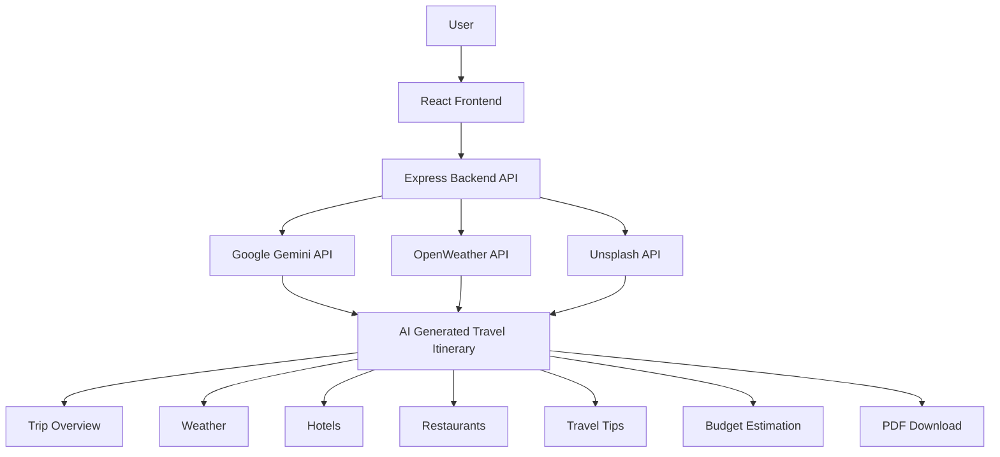
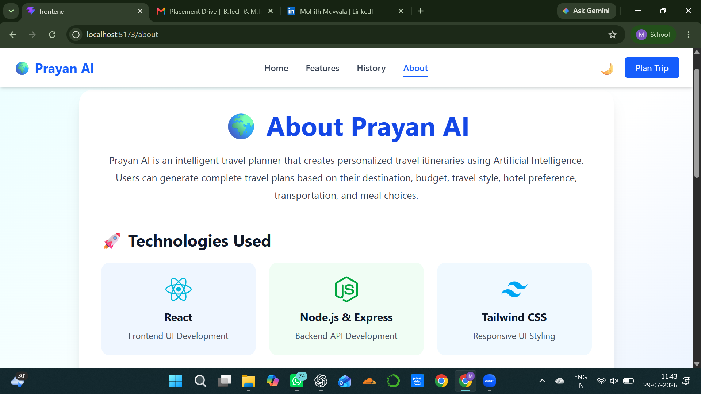
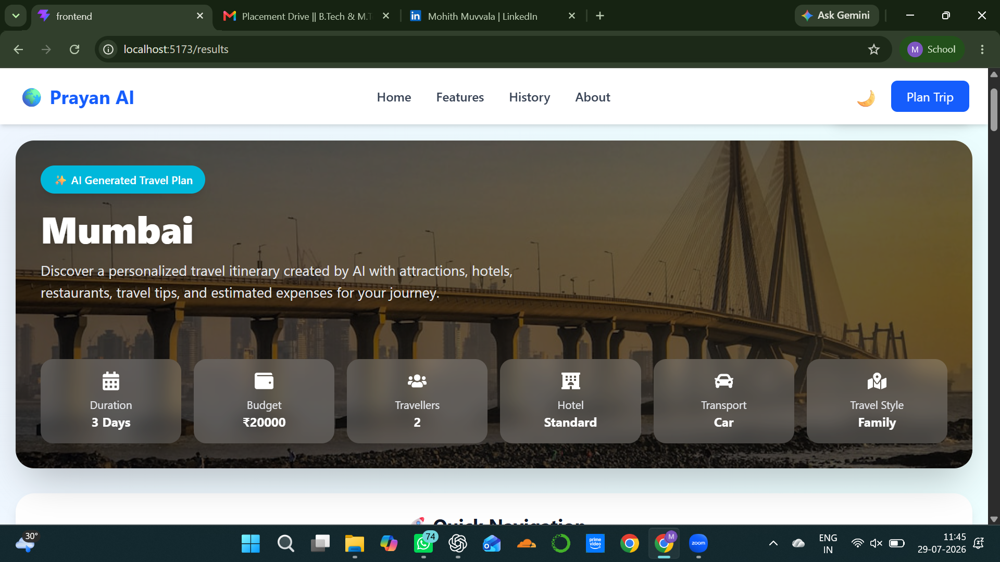
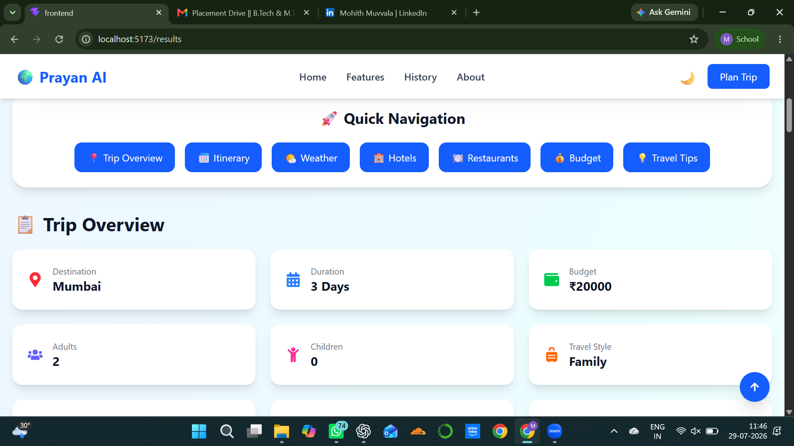
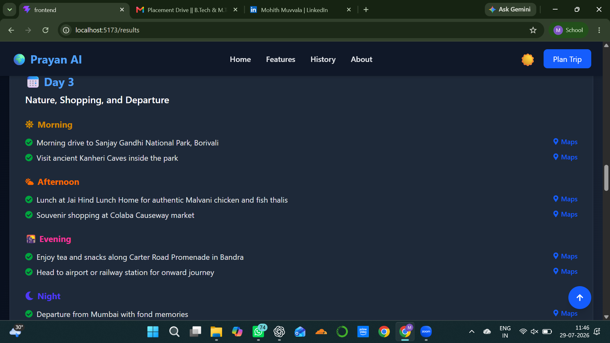

# ✈️ Prayan AI – Trip Planner

<p align="center">
  <strong>Plan Smarter. Travel Better.</strong><br>
  An AI-powered travel planner that generates personalized itineraries based on your destination, travel dates, budget, and preferences.
</p>

---

## 📖 About the Project

Prayan AI is an intelligent trip planning application that helps travelers create personalized travel itineraries in seconds. Users simply provide their destination, travel dates, budget, and travel preferences, and the application generates a structured itinerary enriched with weather forecasts, hotel recommendations, restaurant suggestions, travel tips, and estimated expenses.

The project was developed as part of a frontend internship assignment with an emphasis on transforming AI-generated responses into a reliable, interactive, and user-friendly application.

---

## ✨ Features

- 🤖 AI-generated personalized travel itineraries
- 📅 Day-wise itinerary planning
- 🌤️ Live weather information
- 🏨 Hotel recommendations
- 🍽️ Restaurant suggestions
- 💰 Budget estimation
- 🧭 Travel tips for travelers
- 📄 Download itinerary as PDF
- 🕘 Trip history using Local Storage
- 🌙 Dark Mode support
- 📱 Responsive design for desktop and mobile
- ⚠️ Graceful error handling with retry functionality
- 🔄 Prevents stale API responses using AbortController

---

# 🏗️ System Architecture



---

# 🛠️ Tech Stack

## Frontend

- React
- Vite
- Tailwind CSS
- React Router
- Axios
- jsPDF

## Backend

- Node.js
- Express.js

## AI Integration

- Google Gemini API

## External APIs

- OpenWeather API
- Unsplash API

---

# 📂 Project Structure

```
Prayan-AI-Trip-Planner/
│
├── backend/
│   ├── server.js
│   ├── package.json
│   ├── package-lock.json
│   └── .env
│
├── frontend/
│   ├── public/
│   ├── src/
│   ├── package.json
│   └── vite.config.js
│
└── .gitignore
```

---

# 🚀 Getting Started

## 1. Clone the Repository

```bash
git clone https://github.com/MohitMuvvala04/Prayan-AI-Trip-Planner
```

## 2. Navigate to the Project

```bash
cd Prayan-AI-Trip-Planner
```

## 3. Install Dependencies

### Backend

```bash
cd backend
npm install
```

### Frontend

```bash
cd ../frontend
npm install
```

---

# 🔑 Environment Variables

Create a `.env` file inside the **backend** folder.

```env
GEMINI_API_KEY=your_gemini_api_key
WEATHER_API_KEY=your_openweather_api_key
UNSPLASH_ACCESS_KEY=your_unsplash_access_key
```

> **Important:** Never upload your `.env` file or API keys to GitHub.

---

# ▶️ Running the Application

## Start Backend

```bash
cd backend
npm start
```

## Start Frontend

```bash
cd frontend
npm run dev
```

Visit

```
http://localhost:5173
```

---

# 📸 Application Workflow

1. Enter destination and travel details.
2. Submit the trip request.
3. Backend validates the request.
4. Gemini AI generates a structured itinerary.
5. Weather, hotel, and restaurant information are retrieved.
6. The complete itinerary is displayed.
7. Users can download the itinerary as a PDF.
8. Generated trips are saved locally for future reference.

---

# 💡 Project Highlights

- Clean component-based React architecture
- AI response validation before rendering
- Handles malformed AI output gracefully
- Retry mechanism for failed requests
- Prevents stale responses using AbortController
- Responsive design optimized for desktop and mobile devices
- Dark Mode implementation
- Modular and reusable components
- PDF export support
- Local storage-based trip history

---

# 🔮 Future Enhancements

- User authentication
- Cloud-based trip storage
- Flight recommendations
- Interactive maps
- Expense tracking
- Multi-language support
- Collaborative trip planning
- Share itineraries with friends

---

## ⏱️ Time Spent

Approximately **8 hours** were spent implementing the core application, including the React frontend, Express backend, AI integration, UI development, state management, and error handling.

Additional time was spent on deployment, testing, debugging, and documentation.

---

# 🤖 AI Assistance

This project was developed with the support of AI tools to improve productivity and accelerate the development process.

### AI Tools Used

#### ChatGPT (OpenAI)

Used for:

- Brainstorming feature ideas
- Discussing implementation approaches
- Debugging issues
- Refining UI content
- Improving documentation
- General development guidance

#### Google Gemini

Used as:

- The core AI model integrated into the application for generating personalized travel itineraries.

The overall application architecture, frontend implementation, backend integration, API connections, testing, debugging, customization, and final project review were completed and validated during the development process.

---

# 📷 Screenshots

### 🏠 Home Page




### 🌍 Destination & Places




### 🗺️ Generated Itinerary




### 🌙 Dark Mode



# 🌐 Live Demo


- **Frontend:** https://prayan-ai-trip-planner.vercel.app/


- **Backend API:** https://prayan-ai-trip-planner.onrender.com

---

## 🎥 Demo Video

Watch the complete project demo here:

**Demo:** https://drive.google.com/file/d/1dsePE3PHaPipxw57BzXz7JhPTT4vpL5e/view?usp=drivesdk


# 👨‍💻 Author

**Mohith Muvvala**

🎓 B.Tech – Computer Science and Engineering

📍 SRM Institute of Science and Technology, Andhra Pradesh


**GitHub:** https://github.com/MohitMuvvala04

**LinkedIn:**  https://www.linkedin.com/in/mohith-muvvala/

---

# 📄 License

This project was developed as part of a technical internship assignment and is shared for portfolio and evaluation purposes.
---

## ⭐ If you found this project interesting, consider giving it a star on GitHub!
